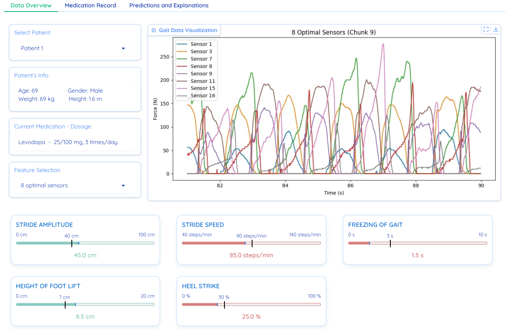
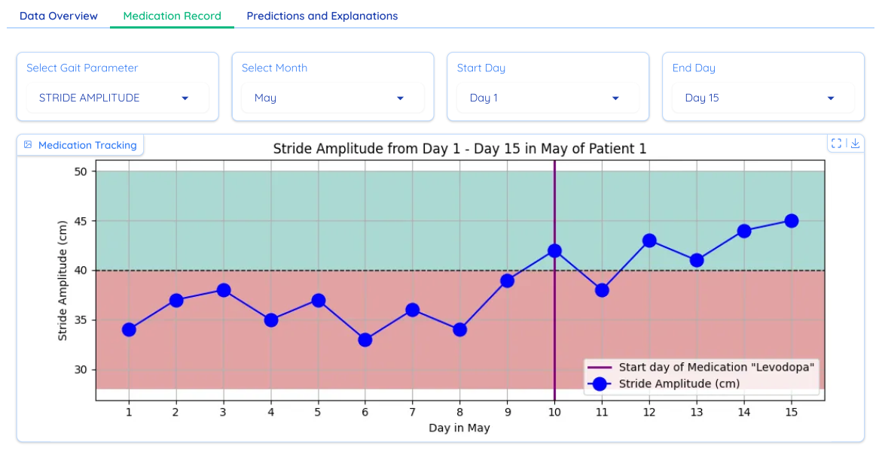
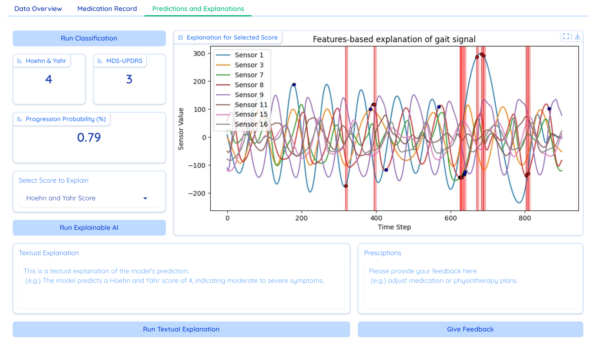

# Clinician-Centered Dashboard for Parkinson’s Disease Care

This repository contains the source code and supporting materials for a clinician-facing dashboard that integrates AI-based analysis of gait data to support Parkinson’s Disease diagnosis, monitoring, and treatment planning with **transparency**, **explainability**, and **contestability** through modular design and Expert-Guided AI Support. Three main interface's tabs with several key features are presented as follows:

## 📝 Gait Session Summary
Provides a detailed visualization of sensor signals from foot-mounted IMUs during gait sessions.

Key Features:
- Time-aligned sensor signal visualization
- Patient-specific session data
- Medication info and feature selection panel
- Interactive gait metric summaries with reference ranges



---

## 📊 Medication History
Displays longitudinal changes in gait features relative to treatment events.

Key Features:
- Temporal trends in motor performance
- Medication timelines for contextual correlation
- Date range selection and metric filtering
- Visual support for evaluating treatment effectiveness



---

## 🔍 Predictive Insight and Explanation 
Presents AI-generated clinical insights with visual and textual explanations.

Key Features:
- Predictions for disease severity and progression
- SHAP-based sensor feature contribution plots
- Natural-language model explanations
- Clinician feedback interface for review and refinement



---

## Usage
Clone repo and install [requirements.txt](requirements.txt):

```
git clone https://github.com/hungdothanh/ai-supported-clinical-gait-analysis.git  # clone
cd ai-supported-clinical-gait-analysis
pip install -r requirements.txt  # install
```

Run demo dashboard: 
```
python demo_gui.py
```

 
