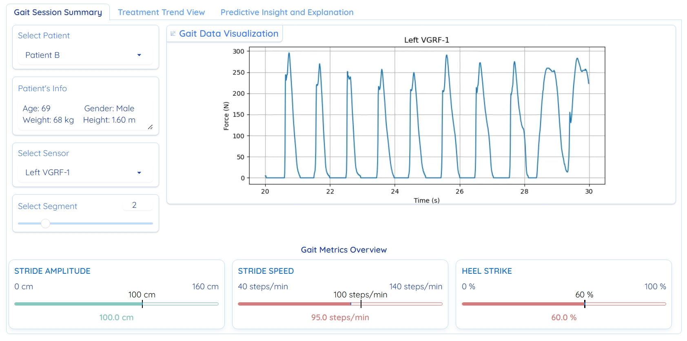

# ConGaIT: Contestable Gait Interpretation & Tracking Dashboard for Parkinson’s Disease Care

This repository contains the source code and supporting materials for **ConGaIT** (Contestable Gait Interpretation & Tracking), a clinician-centered dashboard that embeds Contestable AI (CAI) principles across all interaction layers. Built on human–computer interaction (HCI) and procedural justice foundations, ConGaIT delivers **explainable**, **justifiable**, and **auditable** AI support in Parkinson’s Disease (PD) diagnosis, monitoring, and treatment planning.


## 📝 Tab 1: Gait Session Summary

Visualize per-session gait features (e.g., stride amplitude, freezing) against normative ranges:

- **Color-coded indicators** for quick deviation detection  
- **Interactive 10-second interval explorer**  
- **Sensor channel toggles** & **raw VGRF waveform** view  
- **Context-aware tooltips** explaining each metric in clinical terms  

Clinicians can drill down to individual gait cycles and compare patient data against age-matched norms.




## 📈 Tab 2: Treatment Trend View

Track longitudinal gait changes alongside medication and intervention history:

- **Overlay medication events** (e.g., levodopa doses, DBS adjustments)  
- **AI-based forecasts** of gait metrics for proactive planning  
- **Date-range selector** and **metric filtering**  
- **Alignment with therapeutic milestones** to assess treatment response  

Prioritizes interpretability and traceability by linking each data point to source recordings and medication logs.


## 🔍 Tab 3: Predictive Insight & Explanation

Implement core CAI functions for contestable AI:

1. **CNN-based severity classifier**  
   - Predicts Hoehn & Yahr stage from 10-second gait windows  
2. **Layer-wise Relevance Propagation (LRP)**  
   - Highlights key sensors and temporal segments driving predictions  
3. **LLM-driven justifications**  
   - Meta-Llama-3-8B-Instruct generates rule-based clinical explanations  
4. **Contest & Justify** feedback flow  
   - Clinicians select an argument type:
     - **Factual Error** (data/input issue)  
     - **Normative Conflict** (clinical-context mismatch)  
     - **Reasoning Flaw** (implausible attribution)  
   - System responds with refined justification or model correction  
5. **Immutable audit trail**  
   - Logs all predictions, explanations, contests, and clinician actions for oversight and model improvement


## Usage
Clone repo and install [requirements.txt](requirements.txt):

```
git clone https://github.com/hungdothanh/Con-GaIT.git
cd clinical-gait-analysis-system
pip install -r requirements.txt  # install
```

Run demo dashboard: 
```
python demo_gui.py
```

 
