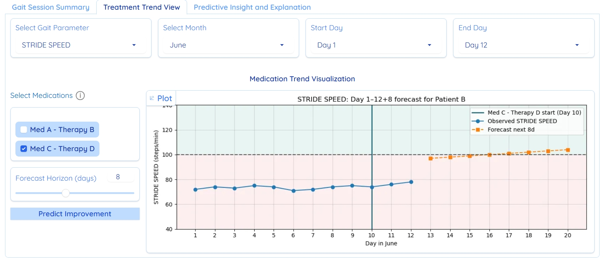

# ConGaIT: Contestable Gait Interpretation & Tracking Dashboard for Parkinson’s Disease Care


## Table of Contents

- [Dashboard Interface with Gradio](#dashboard-interface-with-gradio) 
- [Tab 1: Gait Session Summary](#tab-1-gait-session-summary)  
- [Tab 2: Treatment Trend View](#tab-2-treatment-trend-view)  
- [Tab 3: Predictive Insight & Explanation](#tab-3-predictive-insight--explanation)  
- [Installation and Usage](#installation-and-usage)
- [Proof of Concept](proof-of-concept)


## Overview

This repository contains the source code and supporting materials for **ConGaIT** (Contestable Gait Interpretation & Tracking), a clinician-centered dashboard that embeds Contestable AI (CAI) principles across all interaction layers. Built on human–computer interaction (HCI) and procedural justice foundations, ConGaIT delivers **explainable**, **justifiable**, and **auditable** AI support in Parkinson’s Disease (PD) diagnosis, monitoring, and treatment planning.


## Dashboard Interface with Gradio

ConGaIT’s interactive GUI is built on [Gradio](https://github.com/gradio-app/gradio) — a lightweight Python library for turning your functions into shareable web apps with minimal code.

By leveraging Gradio’s declarative, component-driven architecture, ConGaIT delivers a responsive, shareable web app—clinicians can explore raw signals, review longitudinal trends, and engage in contestable AI flows, all without managing a full-stack framework.


## 📝 Tab 1: Gait Session Summary

Visualize per-session gait features (e.g., stride amplitude, freezing) against normative ranges:

- **Color-coded indicators** for quick deviation detection  
- **Interactive 10-second interval explorer**  
- **Sensor channel toggles** & **raw VGRF waveform** view  

Clinicians can drill down to individual gait cycles and compare patient data against age-matched norms.

<p align="center">
    
</p>


## 📈 Tab 2: Treatment Trend View

Track longitudinal gait changes alongside medication and intervention history:

- **Overlay medication events** to assess treatment response  
- **AI-based forecasts** of gait metrics for proactive planning  
- **Date-range selector** and **metric filtering**  

Prioritizes interpretability and traceability by linking each data point to source recordings and medication logs.

<p align="center">
    
</p>


## 🔍 Tab 3: Predictive Insight & Explanation

Implement core CAI functions for contestable AI:

1. **CNN-based severity classifier**  
   - Predicts Hoehn & Yahr stage from 10-second gait windows  
2. **Layer-wise Relevance Propagation (LRP)**  
   - Highlights key sensors and temporal segments driving predictions  
3. **Contest & Justify** feedback flow  
   - Clinicians select an argument type:
     - **Factual Error** (data/input issue)  
     - **Normative Conflict** (clinical-context mismatch)  
     - **Reasoning Flaw** (implausible attribution)  
   - System responds with refined justification or model correction
4. **LLM-driven justifications**  
   - Passes LRP's explanation, argument flag, and user feedback via a LLM's API to generate rule-based textual explanations  
5. **Immutable audit trail**  
   - Logs all predictions, explanations, contests, and clinician actions for oversight and model improvement

<p align="center">
    
</p>


## Installation and Usage
Clone repo and install [requirements.txt](requirements.txt):

```
git clone https://github.com/hungdothanh/Con-GaIT.git
cd Con-GaIT
pip install -r requirements.txt
```

Open [config.py](config.py) and replace the **MY_KEY** with your **OPENAI_API_KEY**
```
# config.py
OPENAI_API_KEY = "your-openai-api-key-here"
```

Run demo dashboard: 
```
python app.py
```

## Proof of Concept

See ConGaIT in action! Watch our demonstration video to explore the dashboard’s key features—from session summaries and treatment trends to contestable AI insights:

<p align="center">
  <a href="https://youtu.be/vpFJyan8fIQ">
    
  </a>
</p>

